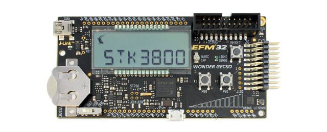
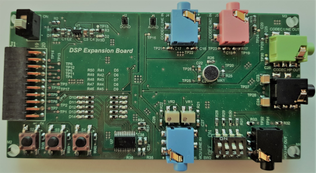

# DSP Expansion Board

The DSP Expansion Board is a HW Expansion Board that has been designed to work with
Silicon Labs&reg; EFM32WG-STK3800 Starter Kit. The Starter Kit is based on an ARM CORTEX-M4 processor with DSP functionalities.

Here an image of the Starter Kit :  

  

To test the Signal Processing capabilities and most important to provide a learnful user experience, the DSP Expansion Board is equipped with multiple Audio IN & OUTPUTS.
  
Here the embedded Audio functionalities : 

    - STEREO LINE IN & OUT using the MCU ADC & DAC

    - STEREO LINE IN & OUT using the integrated TLV320AIC3204 CODEC

    - Onboard Elcetret MONO MIC

    - EXTERNAL MONO MIC IN

    - STEREO HEADPHONE OUT with TLV320AIC3204 CODEC

    - Some general GPIO's [3 Additional Buttons & 10 LED's]

   
And here a first look at the DSP Expansion Board :  

 

## Prerequisites

The Firmware is written in C Language :     

* [C Programming Language](https://en.wikipedia.org/wiki/C_(programming_language))  

Here a good Link about Digital Signal Processing :     

* [DSPguru Website](https://dspguru.com/)

The Project targets Silicon Labs EFM32 Microcontrollers, so following Tools & HW are required :

* [Simplicity Studio V4](https://www.silabs.com/products/development-tools/software/simplicity-studio) - The IDE 
* [EFM32 Wonder Gecko Starter Kit](https://www.silabs.com/products/development-tools/mcu/32-bit/efm32-wonder-gecko-starter-kit) - HW Starter Kit  

And most important to have some fun & make some noise, the DSP Expansion Board !  
Actually the only way to get a board ist write a mail at the following adress :

* [DSP Expansion Board](mailto:thomascova@gmail.com)

## Installing

* Clone the Repository
* Import Project into Simplicity Studio
* Compile Project
* Debug/Run Project on Target HW (EFM32WG-STK3800)

## Built With

* [Simplicity Studio V4](https://www.silabs.com/products/development-tools/software/simplicity-studio) - The IDE used here
* [Eclipse EGit](https://www.eclipse.org/egit/) - GIT Integration for Eclipse based IDE
* [GitHub Flow](https://www.youtube.com/watch?v=PBI2Rz-ZOxU) - Most effective workflow to contribute on GitHub
 
## Authors

* **Thomas Cova** - *Initial work & Developer* - [iceMan83](https://github.com/cov1983) 

## License

This project is licensed under the MIT License - see the [LICENSE.md](LICENSE.md) file for details

## Acknowledgments

* Thanks to all other sources that offered me knowledge for this project :v: :v: 

## Task List

- [x] MCKL Implementation
- [x] I2C Implementation
- [ ] I2S Implementation
- [ ] Record & Playback Implementation
- [ ] LP FIR Filter Implementation

